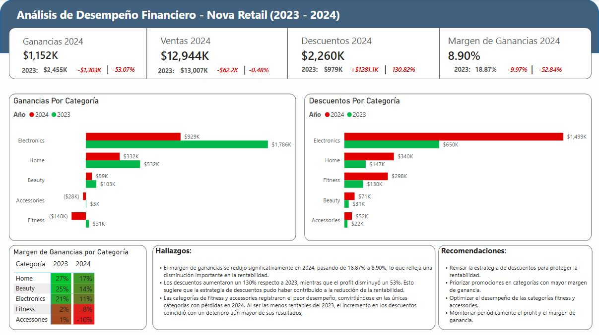

# Nova Retail Business Analysis
Business performance analysis of Nova Retail (2023-2024).

## DASHBOARD

## OBJETIVO.
El objetivo de este proyecto fue analizar el desempeño de Nova Retail durante 2023 y 2024 para identificar los factores que influyeron en la disminución de las ganancias y presentar los resultados mediante un dashboard desarrollado en Power BI.

## HERRAMIENTAS.
MySQL
Power BI
DAX

## DATASET.
El proyecto utiliza un dataset de ventas de Nova Retail compuesto por una tabla de hechos y varias tablas de dimensiones (productos, clientes, regiones y devoluciones), lo que permitió construir un modelo estrella para el análisis.

## LIMPIEZA Y MODELADO.
Revisión de la calidad de los datos.
Construcción del modelo estrella en Power BI.
Creación de relaciones entre la tabla de hechos y las dimensiones.
Creación de una tabla calendario para el análisis temporal.
Desarrollo de medidas DAX para los principales indicadores.

## ANALISIS.
El análisis exploratorio se realizó en MySQL mediante consultas SQL orientadas a evaluar la evolución del revenue, profit, descuentos, devoluciones y margen de ganancia. El archivo con todas las consultas utilizadas se encuentra disponible en este repositorio.

## PRINCIPALES CONCLUSIONES:
- El margen de ganancias se redujo significativamente en 2024, pasando de 18.87% a 8.90%, lo que refleja una disminución importante en la rentabilidad.
- Los descuentos aumentaron un 130% respecto a 2023, mientras que el profit disminuyó un 53%. Esto sugiere que la estrategia de descuentos pudo haber contribuido a la reducción de la rentabilidad. 
- Las categorías de fitness y accessories registraron el peor desempeño, convirtiéndose en las únicas categorías con pérdidas en 2024. Al ser las menos rentables del 2023, el incremento en los descuentos coincidió con un deterioro aún mayor de sus resultados.

## RECOMENDACIONES DE NEGOCIO:
- Revisar la estrategia de descuentos para proteger la rentabilidad.
- Priorizar promociones en categorías con mayor margen de ganancia.
- Optimizar el desempeño de las categorías fitness y accessories.
- Monitoriar periódicamente el profit y el margen de ganancia.
